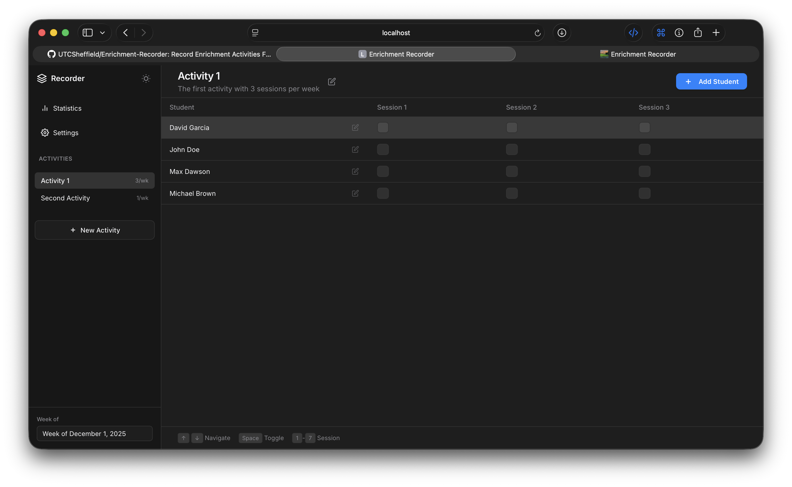
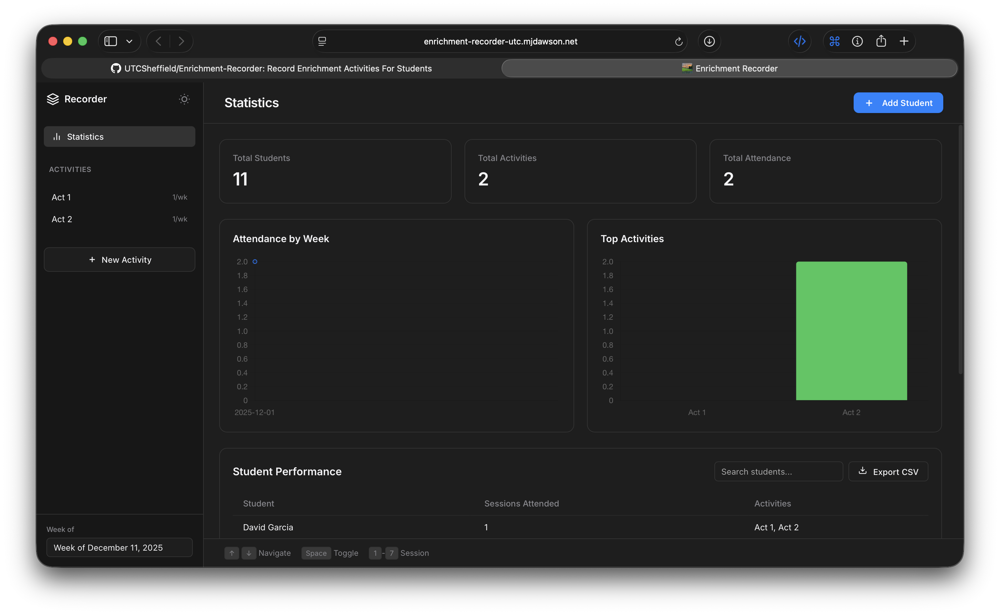
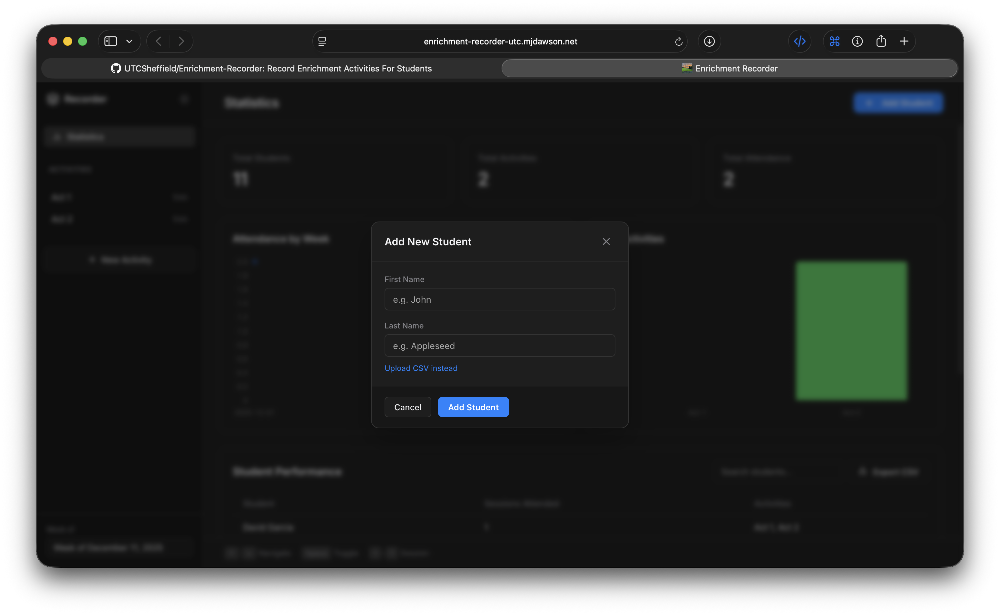
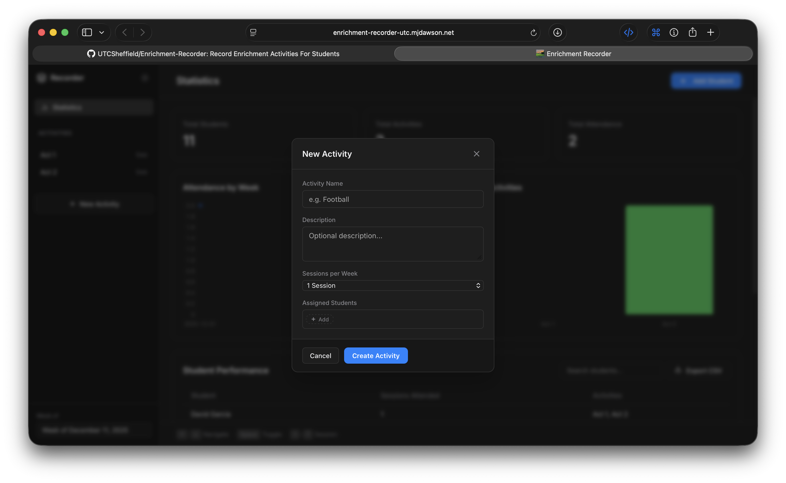
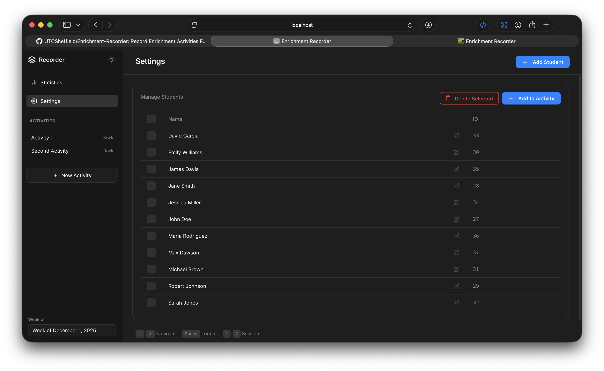

# Enrichment Recorder
A single-page PHP application to record student attendance for enrichment activities.

Uses PHP and MYSQL runs through a docker container.

## Screenshots

Below are example screenshots of the application in action:

### Main Page (with 2 Example Activities)


### Statistics Page


### Add Student Page


### Create Activity Page


### Create Activity Page


## Run with Docker
This setup runs the application with Apache/PHP and a MySQL database.

1. Ensure **Docker** is installed and running.
2. Create a `.env` file from the example: (optionally use some other method to handle environment variables)

   ```bash
   cp .env.example .env
   ```

   and buddy, for the life of you, change the default password.

3. Run the following command in the project root:

```bash
docker compose up --build
```

4. Open `http://localhost:8080` (or the port defined in your `.env` file) in your browser.