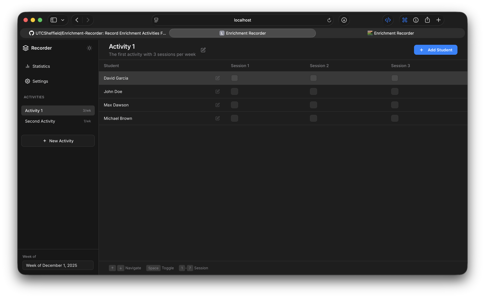
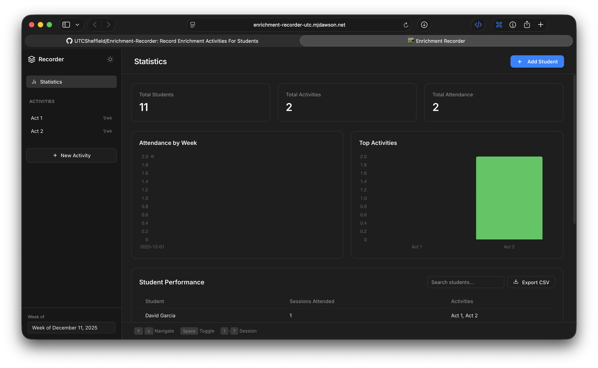
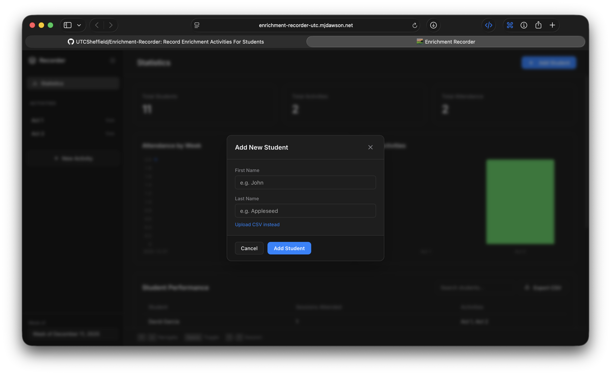
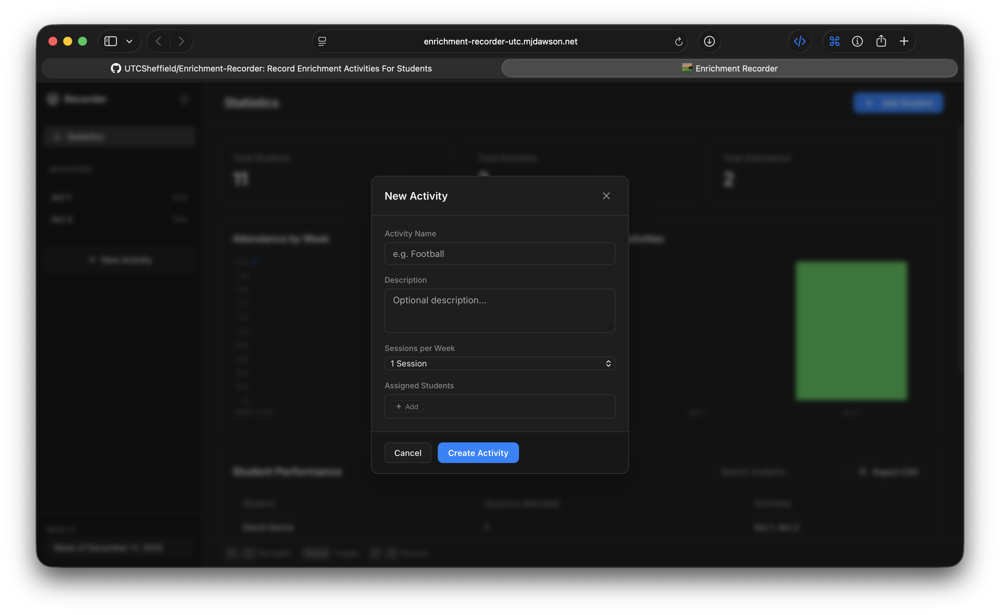
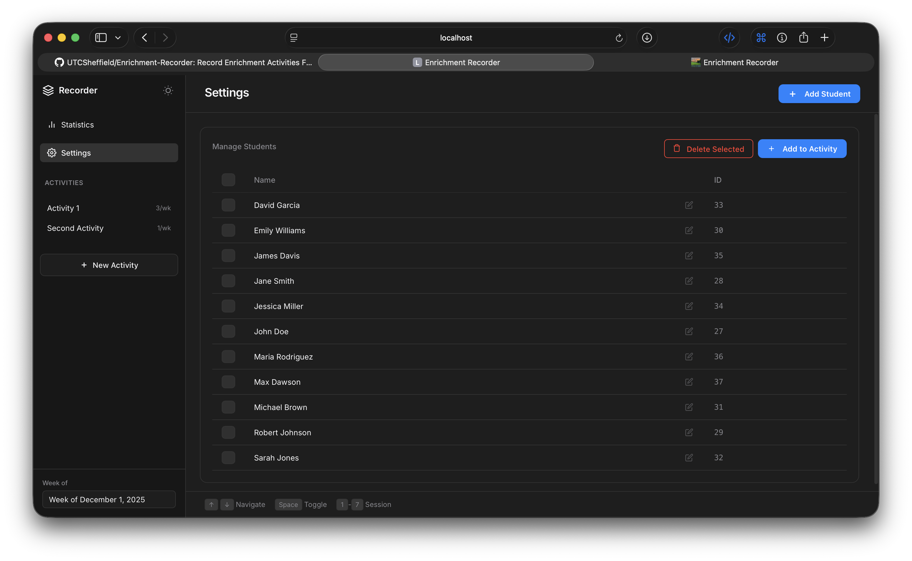

# Enrichment Recorder
A single-page PHP application to record student attendance for enrichment activities.

Uses PHP and MYSQL runs through a docker container.

## Screenshots

Below are example screenshots of the application in action:

### Main Page (with 2 Example Activities)


### Statistics Page


### Add Student Page


### Create Activity Page


### Settings page


## Run with Docker
This setup runs the application with Apache/PHP and a MySQL database.

1. Ensure **Docker** is installed and running.
2. Create a `.env` file from the example: (optionally use some other method to handle environment variables)

   ```bash
   cp .env.example .env
   ```

   and buddy, for the life of you, change the default password.

## Password Roles
When you open the site, you’ll be prompted for a password. The password you enter determines your role:

- **Admin** (`ADMIN_PASSWORD`): full access (Statistics + Settings + student management).
- **Head of Subject** (`HEAD_OF_SUBJECT_PASSWORD`): can create/edit activities, assign students to activities, and mark attendance.
- **Teacher** (`TEACHER_PASSWORD`): can mark attendance and assign students to existing activities.

These shared passwords are configured in `.env` / `.env.example`.

3. Run the following command in the project root:

```bash
docker compose up --build
```

4. Make sure that you reset the details in the .env for password and encryption key.

5. Open `http://localhost:8080` (or the port defined in your `.env` file) in your browser